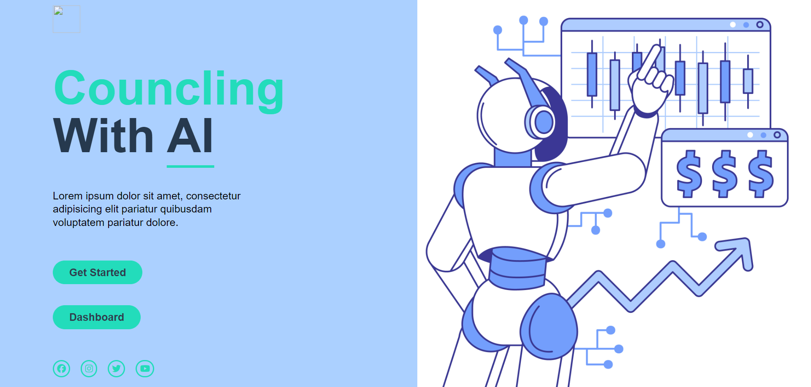
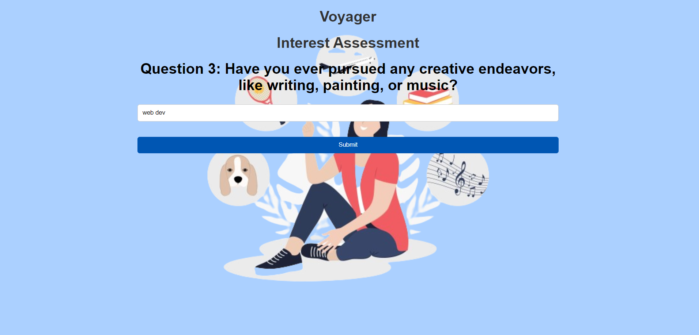

# NEXTNICHE

project for Nextniche by Team **Equalizers**
 
[project link]:()

## Problem Statements

- Making **career** choices with **AI based counselling** accessible to every student at
  secondary and higher level based on aptitude tests and interest assessment and
  detailed career paths

## Solution

Meet our product Counseler. A AI based counseling for detailed career path.

<!--  -->

-

## Key Features

Career path guidance by using AI 

 

<!--  -->

## Requirements

A smart phone

## Technology Stack

- [MongoDB]: MongoDB is a NoSQL database program, using a document-oriented data model to store data in flexible, JSON-like documents, making it easy to integrate data in modern applications.

- [Node.js]: Node.js is an open-source, cross-platform JavaScript runtime environment that executes JavaScript code outside a web browser, allowing developers to build scalable, high-performance applications.

- [HTML], [CSS], and [JavaScript]: HTML (HyperText Markup Language), CSS (Cascading Style Sheets), and JavaScript are the core technologies used for building websites and web applications. HTML provides the structure, CSS handles the presentation, and JavaScript adds interactivity and functionality.

- [API] Integration: API Integration facilitates communication between different software systems, allowing them to exchange data and functionalities seamlessly.

## What Inspired Us?

- Over childhood!!
- Increasing Competition!!
- peer pressure is also an important role 
- confused seconodary level student  
   

## TEAM
Team Member 1: **Akhilesh Patidar**
 
Team Member 2: **Ankit Rai** 
 
Team Member 3: **Nepal Singh**
 
Team Member 4: **Kunal Singh** 
